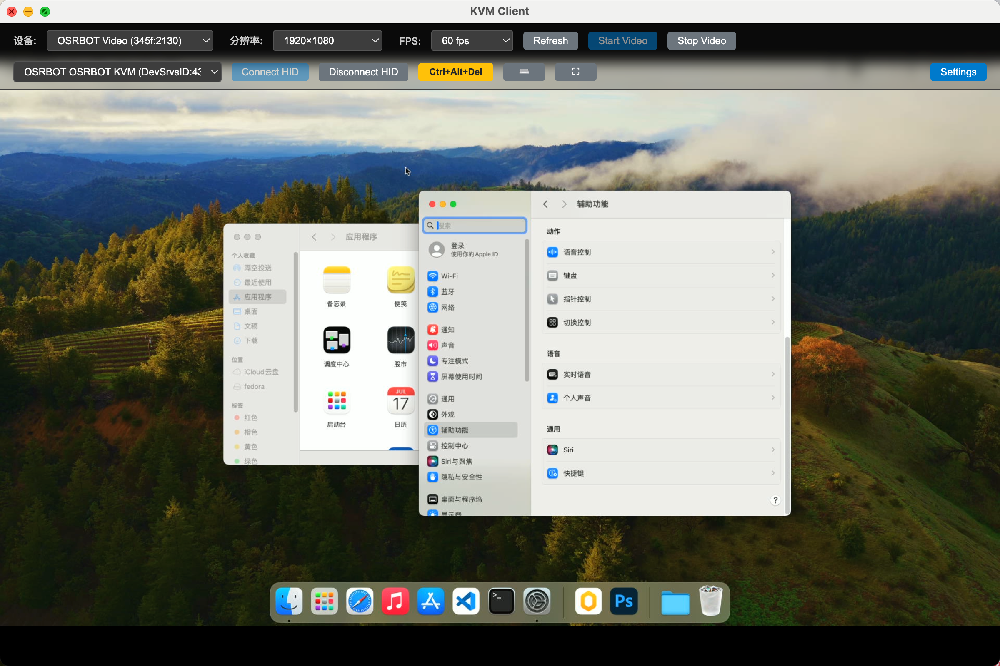
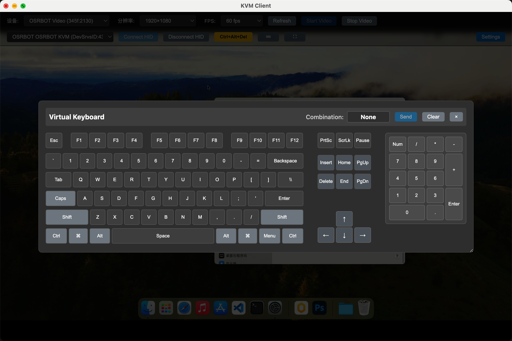

# USB KVM Client

[中文](README.md) | English

## What is this?

USB KVM Client is a cross-platform software KVM (Keyboard-Video-Mouse) client built with Electron. It enables you to control a remote computer through a USB hardware KVM device (based on CH582F(or similar MCU) + MS2130 capture card).

This project is an alternative host client for:
- [osrbot/osrbot_client](https://github.com/osrbot/osrbot_client)

Original Project:
- [Jackadminx/KVM-Card-Mini](https://github.com/Jackadminx/KVM-Card-Mini)






**Key Differences:**
- **Cross-platform**: Supports macOS (x64/ARM64), Windows (x64/ARM64), and Linux (x64/ARM64)
- **Modern Architecture**: Built with Electron + Rust native modules instead of Python/PySide
- **Enhanced Keyboard Capture**: Uses platform-specific low-level keyboard hooks (inspired by RustDesk) instead of simple keyboard lock
- **Better Performance**: Direct WebRTC video capture, optimized HID protocol implementation

## How It Works

1. **Video Capture**: Captures video from USB video capture device (MS2130 or compatible) using WebRTC API
2. **HID Communication**: Sends keyboard/mouse events to the remote computer via USB HID protocol through your STM32-based KVM hardware
3. **Keyboard Capture**: Uses native Rust module with rdev library for system-level keyboard capture (blocks OS shortcuts when in control mode)
4. **Two Mouse Modes**:
   - **Absolute Mode**: Click-to-position (direct coordinate mapping)
   - **Relative Mode**: Traditional mouse movement (delta positioning)

## How to Use

Please check the [Release Notes](../../releases) for:
- Platform-specific installation instructions
- First-time setup guide
- Permissions requirements (macOS Accessibility, Linux udev rules)
- Troubleshooting common issues

### Quick Start

**Linux (Ubuntu 22.04+):**
```bash
# Install fuse2 dependency
sudo apt install libfuse2

# Make AppImage executable and run
chmod +x KVM-Client-*.AppImage
./KVM-Client-*.AppImage
```

**Linux (Ubuntu < 22.04):**
```bash
# Install fuse2 dependency
sudo apt-get install fuse libfuse2

# Make AppImage executable and run
chmod +x KVM-Client-*.AppImage
./KVM-Client-*.AppImage
```

**Note:** If the AppImage fails to launch due to version number in filename, rename it to something simpler (e.g., `KVM.AppImage`)

**macOS:**
- Mount the DMG and drag to Applications
- Grant Accessibility and Input Monitoring permissions when prompted

**Windows:**
- Run the installer or use the portable version
- No special permissions required

## Architecture & Technical Details

### Core Components

1. **Main Process** (`src/main.js`)
   - Electron main process
   - Window management and IPC communication
   - Native keyboard module integration
   - System tray and global shortcuts

2. **HID Manager** (`src/hid-manager.js`)
   - USB HID device communication
   - Keyboard/mouse event translation to HID protocol
   - Modifier key tracking and buffer rotation
   - Auto-reconnection on device disconnect

3. **Native Keyboard Grabber** (`native/rdev-grabber/`)
   - Rust native N-API module
   - Platform-specific keyboard hooks:
     - **Windows**: Low-level keyboard hook (WH_KEYBOARD_LL) with message pump
     - **macOS**: CGEvent tap with Accessibility API
     - **Linux**: evdev-based grabbing via rdev
   - Blocks system shortcuts when in control mode
   - Handles phantom key detection (macOS rdev bug fix)

4. **Renderer Process** (`src/renderer/`)
   - WebRTC-based video capture
   - UI controls and settings
   - Mouse event handling (absolute/relative modes)

### Advancements Over Similar Projects

**1. Better Keyboard Capture**
- Uses low-level OS hooks instead of simple keyboard lock
- Properly blocks Windows key, system hotkeys (Alt+Tab, etc.)
- Inspired by RustDesk's approach - thanks to the RustDesk project for the excellent reference implementation

**2. Cross-Platform Support**
- Single codebase for macOS, Windows, and Linux
- Native module with platform-specific optimizations
- Proper ARM64 support for Apple Silicon and Windows ARM

**3. Modern Tech Stack**
- Electron for UI (instead of PySide/Qt)
- Rust for performance-critical native code
- WebRTC for low-latency video streaming
- N-API for stable native module ABI

**4. Enhanced HID Protocol**
- Proper modifier key state tracking
- Buffer rotation to prevent key stuck issues
- Support for all standard keys and function keys
- Mouse wheel and multi-button support

### Hardware Compatibility

**Important:** This application is currently configured for a specific HID device:
- **Vendor ID**: `0x413D`
- **Product ID**: `0x2107`
- **Usage Page**: `0xFF00`

If you have your own STM32-based KVM hardware with different VID/PID, you need to modify the device filter in `src/hid-manager.js`:

```javascript
// Find and modify these values in hid-manager.js
const DEVICE_FILTER = {
  vendorId: 0x413D,   // Your device's VID
  productId: 0x2107,  // Your device's PID
  usagePage: 0xFF00   // Your device's usage page
};
```

## Building from Source

```bash
# Install dependencies
npm install

# Build native module
npm run build:native

# Run in development
npm run dev

# Create distribution packages
npm run dist
```

For Ubuntu 20.04 or systems with older GLIBC, use rebuild variants:
```bash
npm run build:rebuild
npm run dist:rebuild
```

## Acknowledgments

Special thanks to:
- **[RustDesk](https://github.com/rustdesk/rustdesk)**: For the excellent reference implementation of cross-platform keyboard capture, which greatly improved this project's keyboard handling
- **[rdev](https://github.com/Narsil/rdev)**: For the low-level keyboard/mouse event library

## License

MIT License - see LICENSE file for details
